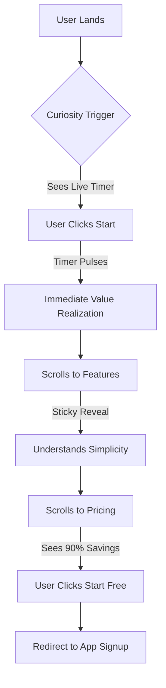

# timedigits Landing Page - Comprehensive Redesign Plan

**Date:** December 27, 2025
**Status:** Planning Phase (Synthesized from Multi-Agent Analysis)
**Project:** timedigits-landing

---

## 1. Executive Summary

This plan outlines a complete overhaul of the `timedigits-landing` page. The goal is to transition from a "basic" SaaS template to a "best-in-class" interactive experience that evokes curiosity and demonstrates the product's core value proposition ("Track time. That's it.") through sophisticated design, precise spacing, and smart animations.

### Core Objectives
- **Eliminate "Lazy" Design:** Fix overlaps, centering issues, and inconsistent spacing.
- **Interactive Storytelling:** Show, don't just tell. Let users "play" with the timer immediately.
- **Premium Feel:** Use high-end typography (Satoshi + JetBrains Mono) and choreographed motion.
- **Flawless Responsiveness:** Tailored layouts for Mobile, Tablet, and Desktop.

---

## 2. Brand & Strategy Understanding

Synthesized from `timedigits-brand-strategy.md`, `timedigits-landing-analysis.md`, and `timedigits-pricing-strategy.md`.

### 2.1 Brand Identity
- **Tagline:** "Track time. That's it."
- **Personality:** Honest, Minimal, Refreshing.
- **Value Prop:** Time tracking that takes seconds to learn and costs almost nothing ($1/user or $5 flat for teams).
- **Visual Style:** "Refined Technical Precision" - Swiss minimalism meets modern SaaS.

### 2.2 Pricing Strategy (The "Outcome-Based" Model)
- **Solo:** Free forever (Unlimited tracking, projects, history).
- **Team:** $5/month flat (up to 5 members) + $1/member/month beyond that.
- **Competitive Edge:** 75-90% cheaper than Toggl ($9/mo) or Harvest ($12/mo).

---

## 3. Current Site Analysis & Code Structure

### 3.1 Existing Code Tree Map
```text
timedigits-landing/
├── public/
│   └── favicon.svg
├── src/
│   ├── assets/          # Static assets
│   ├── components/      # React components
│   │   ├── CTA.tsx      # Bottom call to action
│   │   ├── Features.tsx # Bento grid (to be redesigned)
│   │   ├── Footer.tsx   # Site footer
│   │   ├── Header.tsx   # Sticky navigation
│   │   ├── Hero.tsx     # Hero section with basic typewriter
│   │   ├── HowItWorks.tsx # Timeline (to be redesigned)
│   │   ├── Logo.tsx     # SVG Logo component
│   │   └── Pricing.tsx  # Pricing cards & comparison
│   ├── lib/
│   │   └── animations.ts # Basic CSS animation logic
│   ├── App.tsx          # Main entry point
│   ├── index.css        # Tailwind v4 styles & design tokens
│   └── main.tsx         # React DOM mounting
├── package.json         # Dependencies (React 19, Tailwind v4, Framer Motion)
└── vite.config.ts       # Build configuration
```

### 3.2 Redirects & External Links
- **Login/Sign In:** Must redirect to `https://app.timedigits.ca/login`
- **Start Free / Get Started:** Must redirect to `https://app.timedigits.ca/signup`
- **Dashboard (Post-Login):** `https://app.timedigits.ca/`

---

## 4. Design System & Spacing (Agent 1: UX/UI Conclusion)

### Spacing Strategy
We will move away from arbitrary margins to a strict **8px Geometric Scale**.
- **Section Padding:** `clamp(80px, 15vh, 160px)` for vertical breathing room.
- **Component Gaps:** Consistent `gap-4` (16px), `gap-8` (32px), and `gap-12` (48px).
- **Centering:** All main containers will use `max-w-7xl` with `mx-auto` and `px-6`.

### Typography Refinement
- **Headlines:** Satoshi (Bold/Black) with tight tracking (`-0.02em`).
- **Monospace:** JetBrains Mono for all time-related data and technical labels.
- **Body:** Inter or System Stack for maximum readability.

---

## 5. Component Architecture (Agent 3: Engineering Conclusion)

### 5.1 Hero: The "Live Demo" Engine
Instead of a static image or a simple auto-incrementing timer, the Hero will feature a **Functional Mini-App**.
- **Interactive Timer:** A large, centered JetBrains Mono clock that users can Start/Stop.
- **State Persistence:** The timer state should feel "real" (using local state or simple session storage).
- **Visual Feedback:** When active, the background subtly pulses with a teal glow.

### 5.2 Features: The "Sticky Reveal" Showcase
Replacing the "stupid" bento grid with a **Scroll-Linked Feature Reveal**.
- **Left Side:** Sticky text descriptions that fade in/out as you scroll.
- **Right Side:** A dynamic UI preview that changes based on the active feature (e.g., showing the export UI, the team view, etc.).

### 5.3 Pricing: The "Comparison Engine"
Fixing the buggy comparison design.
- **Visual Hierarchy:** The "Team" card should be slightly larger with a "Glow" border.
- **Competitor Table:** A clean, centered table comparing `timedigits` vs `Toggl` vs `Harvest`.
- **No Overlaps:** Use `relative` positioning and `z-index` carefully to ensure titles never overlap with boxes.

---

## 6. Animation & Library Selection (Aceternity UI)

We will use **Aceternity UI** as the primary library for high-impact animations, supplemented by **Framer Motion** for custom interactions.

### Selected Aceternity Components
- **BackgroundBeams:** For the Hero section to create a futuristic, deep-space feel.
- **TextGenerateEffect:** For the "Track time. That's it." headline reveal.
- **StickyScrollReveal:** For the Features section to create the "Sticky Reveal" showcase.
- **HoverBorderGradient:** For the primary CTA buttons and the "Team" pricing card.
- **TracingBeam:** For the "How it Works" timeline section.

### Icon Set
- **Phosphor Icons:** Selected for its modern, designer-centric aesthetic that complements Aceternity's style.

### Animation Specs
- **Easing:** `[0.16, 1, 0.3, 1]` (Ease Out Expo) for a snappy, premium feel.
- **Duration:** 0.4s to 0.8s depending on the scale of the movement.

---

## 7. Responsive Layout Map

| Element | Mobile (375px) | Tablet (768px) | Desktop (1280px+) |
|---------|----------------|----------------|-------------------|
| **Hero** | Stacked, Timer below text | Side-by-side or Stacked | Large centered layout |
| **Features** | Single column list | 2-column grid | Sticky Reveal (Split Screen) |
| **Pricing** | Vertical cards | Horizontal cards | Horizontal cards + Comparison |
| **Header** | Hamburger menu | Hamburger menu | Full navigation |

---

## 8. Implementation Roadmap

### Phase 1: Foundation (The "Skeleton")
- [ ] Clean up `index.css` and define new Tailwind v4 variables.
- [ ] Set up `framer-motion` global configurations.
- [ ] Implement the new `Container` and `Section` wrappers.

### Phase 2: The Hero Experience
- [ ] Build the `InteractiveTimer` component with full state logic.
- [ ] Implement the "Typewriter 2.0" with better cursor handling.
- [ ] Add the "Magnetic" effect to primary CTAs.
- [ ] **Fix Redirects:** Update all buttons to point to `https://app.timedigits.ca/signup` and `login`.

### Phase 3: Feature Storytelling
- [ ] Build the `StickyFeatureShowcase` component.
- [ ] Create the "UI Mockups" for each feature (Export, Reports, Teams).

### Phase 4: Pricing & Trust
- [ ] Redesign `PricingCard` with sophisticated hover states.
- [ ] Build the `CompetitorComparison` table (Mobile-responsive).
- [ ] Add the "Logo Cloud" for social proof.

### Phase 5: Polish & QA
- [ ] Audit all device sizes (iPhone, iPad, Desktop).
- [ ] Refine animation timings for "snappiness".
- [ ] Fix any remaining overlaps or layout bugs.

---

## 9. Mermaid Workflow


